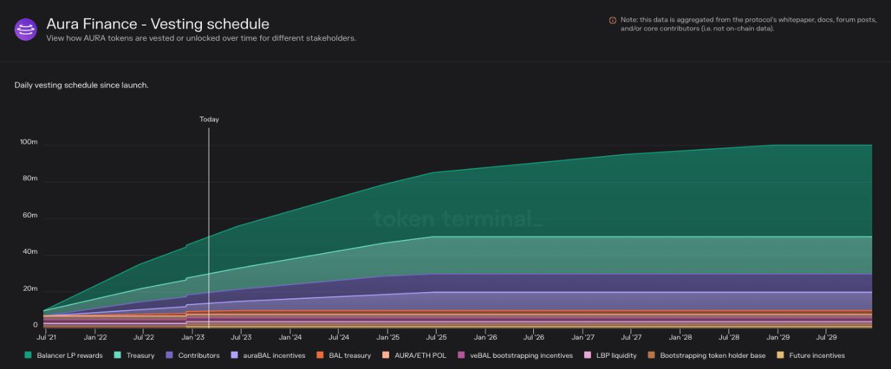

# Distribution

Aura's proposed and intended token emission and distribution will resemble the following:

### Emission

<figure><figcaption></figcaption></figure>

### Distribution stated before launch

* 50% Balancer LP rewards Rewarded pro-rata for BAL received on Aura
* 10% for StableSwap auraBAL/BPT over 4 years
* 2% added to an LBP to bootstrap liquidity
* 3% to be paired with earned ETH in an 80/20 AURA/ETH LP (initial liquidity)
* 17.5% Treasury vested over 4 years
* 2.5% bootstrapping token holder base
* 1% for future incentives
* 2% BAL treasury over 2 years
* 2% veBAL bootstrapping incentives
* 10% for the Aura contributors over 2 years
* 100% Fair launched no VC - Seed investors

#### Changes to pre-launch schedule:

* Just under 1.7 million of 2 million planned were claimed in the LBP.
* 2 million of the allocated 3 million planned were paired with ETH for initial liquidity.
* Just under 1.5 million of the 2.5 million earmarked for bootstrapping token holder base were clawed back due to being unclaimed.

In net this resulted in an additional 2.82 million AURA added to the community treasury, for a total of 2.82% of supply.

**Additional AURA allocated by governance in the first 16 week locking epoch(current as of 10.10.2022):**

<table><thead><tr><th width="436">AIP</th><th width="181.33333333333331">Units</th><th>% Supply</th></tr></thead><tbody><tr><td><a href="https://forum.aura.finance/t/aip-1-community-management-and-growth/21">AIP-1 - Fund Community Management</a></td><td>50,000</td><td>0.05%</td></tr><tr><td><a href="https://forum.aura.finance/t/aip-3-increasing-aura-float-and-liquidity-while-building-dao-runway/92/23">AIP-3 - Increase float</a></td><td>350,000</td><td>0.35%</td></tr><tr><td><a href="https://forum.aura.finance/t/aip-5-aura-foundation-funding-proposal/104/19">AIP-5 - Aura Foundation</a></td><td>300,000</td><td>0.30%</td></tr><tr><td><a href="https://forum.aura.finance/t/aip-6-deepening-aura-eth-liquidity-with-hidden-hand-incentives-from-treasury/108/8">AIP-6 - HH incentives for AURA/ETH LP</a></td><td>780,000</td><td>0.78%</td></tr><tr><td><a href="https://forum.aura.finance/t/aip-15-aura-ecosystem-fund/204/14">AIP-15 - Ecosystem fund</a></td><td>500,000</td><td>0.50%</td></tr><tr><td><strong>Total AURA spent by AIP</strong></td><td><strong>1,980,000</strong></td><td><strong>1.98%</strong></td></tr></tbody></table>

#### AURA vs BAL (LP Rewards)

In the above distribution, it notes that 50% of AURA supply will be distributed pro-rata for BAL earned on Aura. The chart above is modelled assuming 80% of all $BAL is earned on Aura.

The following function is used to calculate the amount of Aura units minted per BAL. On day 1, there will be 3.9 AURA emitted per BAL. This trends towards 1.4 AURA per BAL as supply increases.

`auraUnitsMinted = (((500 - (totalSupply() - 50000000) / 100000) * 2.5 + 700) / 500) * balEarned`

